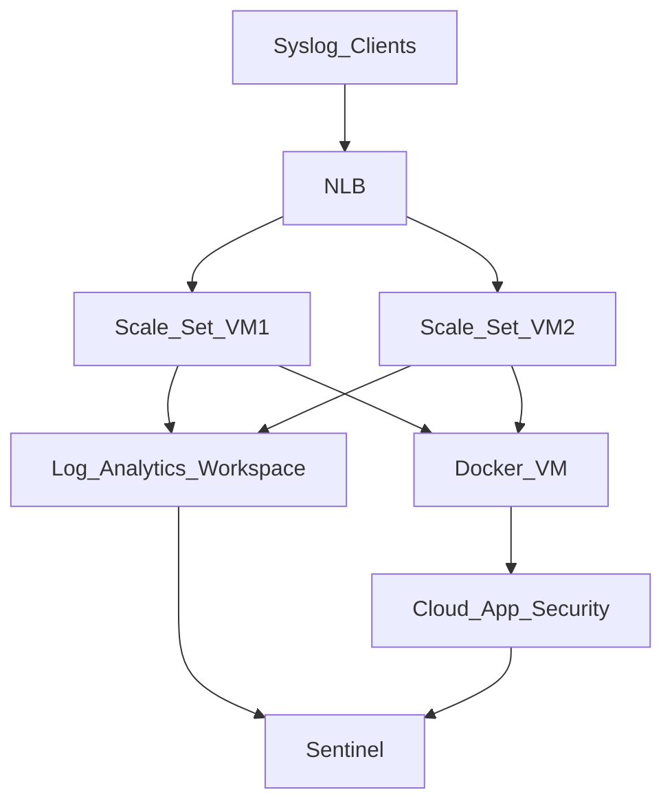

# Rsyslog for Sentinel
## A redundant & robust Rsyslog Server for ingesting logs to sentinel
### Requirements 
Sentinel relies on Linux Rsyslog server for capturing data from various firewall solutions (checkpoint - fortigate - darktrace).

Our task is to build a fully redundant [virtual machine scale set](https://docs.microsoft.com/en-us/azure/virtual-machine-scale-sets/overview) that can scale up or down on Azure and will host an RSYSLOG server and dispatch the data to Sentinel.

We will have to create different log files on every RSYSLOG server (vm on scaleset) for each vendor that dispathces data (e.g. fortinet) by tweaking rsyslog.conf file. 

Rsyslog server will have to forward specific log files on docker image. The docker image will use the logs for Microsoft's Cloud App Security ([CASB](https://en.wikipedia.org/wiki/Cloud_access_security_broker)) for [discovering](https://docs.microsoft.com/en-us/defender-cloud-apps/discovery-docker-ubuntu-azure?tabs=centos) new applications on CASB.    

The scale set will need an [OMS agent](https://github.com/microsoft/OMS-Agent-for-Linux) for dispatching the logs to the log analytics workspace that Sentinel is using. 

The scale set will need to be part of a configuration management system where all conf files will be hosted and persisted during boot time and during runtime.

### Requirements Breakdown 
- NLB, VM Scaleset will be deployed on the same resource group. 
- The scale set will have 2 VMs with the same specifications.
- The scale set will increase if CPU on one VM is running above 75% for 5 minutes.
- The scale set will be able to grow up to 4 VMs in total.
- The scale set should have the ability to mount dynamically their hard disks.
- We should assume that we are expecting high data volume from the clients (80GB/hour) for each log.   
- We will use cloud-init configuration for applying configuration during boot time.
- We will use Azure Automation account and apply DSC configuration for persisting configuration every 15 minutes.

### Design
Assumptions:
- We already have an Azure Subscription to deploy our solution.
- We already have VNET where we will deploy all our components.
- We have a dedicated subnet where all devices will be connected to.
- We will have a NSG that will allow traffic to all devices.
- Azure is already connected with on premise devices (syslog clients).
- All networking devices are configured to dispatch syslogs to network load balancer's external IP.
- Load balancer will work on a round robin fashion for dispatching logs to VM scale set.
- We will have unequal log sizes for each client.
- For DSC an already existing automation account will be used.
- We already have a log analytics workspace for storing logs.
- Log analytics workspace and automation is already associated. 
- Microsoft's Sentinel is configured for using the log analytics workspace.

### Tests for approving system functionality
1. Setup NLB & VMs and send logs to the NLB.
   We should see logs on both Virtual Machines.
2. Logs will fill up 90% of hard disk space.
   Logrotate should rotate the log files and empty hard disk drive of log archives.
3. CPU of one of the VMs reaches 75% consumption for over 5 minutes.
   A new VM will start with the same configuration as the rest of the VMs.
   NLB rules should update automatically and logs should be dispatched to the new VM.
4. CPU of one of the VMs is below 75% consumption for over 5 minutes.
   The extra VM should stop. 
   NLB rules should update automatically and logs should be dispatched to the remaining VMs. 

Azure SKUs to select:
- Standard NLB.
- D2s_v3 with extra data SSD premium hard disk (256GB) for the logs.
- Flexible VM Scale Set. 
- Each VM will have a single Network interface unit.
- Network acceleration must be used.
- VM Generation 2 will be used.
 
NLB configuration
- We will have a frontend configuration with a public IP.
- We will have 2 backend pools for the syslog servers - TCP 514 & UDP 514 will be forwarded to each VM.
- We will have a health probe that will check every 5 seconds if the VMs can respond on 3 consecutive packets on TCP 514 port.

VM configuration
- VMs will have 2 vCPUs , 8GB RAM and 32GB temporary hard disk.
- VMs will have swap file enabled.
- All hard disks will be SSD Premium optimized for both data write & read. 
- We will use an extra data disk of 512GB for hosting RSYSLOG files.
- We will use SSH PEM keys for accessing the VM.
- We will use Centos 7.9 OS and apply the latest updates.
- We will use cloud-init for applying the configuration during boot.
- We will use DSC to check & apply DSC configuration from azure automation account. 
- VMs will use Azure Linux VM agent to deploy Azure VM extensions. 
- We will use the following VM extentions:
    - AADSSHLoginForLinux - for logging in with Azure AD accounts
    - MDE.Linux - Defender Antivirus  
    - VulnerabilityAssement - Vulnerability Assessment
    - IaaSAntimalware - Antimalware 
- We will disable SELinux
- All log files for syslog will be hosted on /var/log/rsyslog

### Implementation
Our implementation will follow a bottom up approach. We will configure all components and then mix them together on an [ARM template](https://docs.microsoft.com/en-us/azure/azure-resource-manager/templates/) to deploy all components on Azure.
| **Configuration** | **README**                 |
| ----------------- | ---------------------------|
| cloud-init        | [cloud-init/README.md][ci] |
| dsc               | [dsc/README.md][dsc]       |

[ci]: <https://github.com/sip03ds/AzAdmin/tree/original/RSyslog_Sentinel/cloud-init/README.md>
[dsc]: <https://github.com/sip03ds/AzAdmin/tree/original/RSyslog_Sentinel/dsc/README.md>