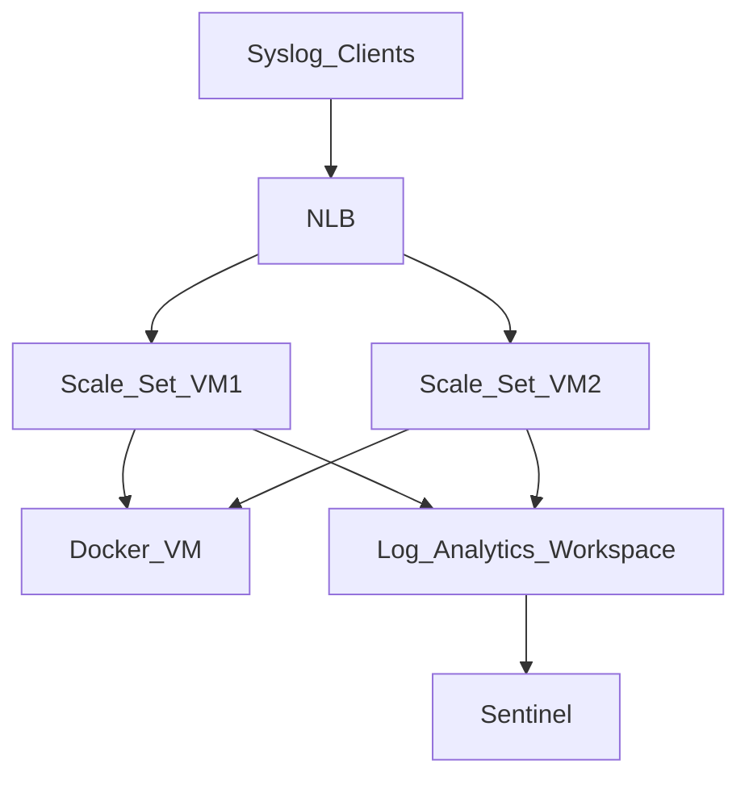

# Rsyslog for Sentinel
## A redundant & robust Rsyslog Server for ingesting logs to sentinel
### Requirements 
Sentinel relies on Linux Rsyslog server for capturing data from various firewall solutions (checkpoint - fortigate - darktrace).

Our task is to build a fully redundant [virtual machine scale set](https://docs.microsoft.com/en-us/azure/virtual-machine-scale-sets/overview) that can scale up or down on Azure and will host an RSYSLOG server and dispatch the data to Sentinel

We will have to create different log files on every RSYSLOG server (vm on scaleset) for each vendor that dispathces data (e.g. fortinet) by tweaking rsyslog.conf file. 

Rsyslog server will have to forward specific log files on docker image. The docker image will use the logs for Microsoft's Cloud App Security ([CASB](https://en.wikipedia.org/wiki/Cloud_access_security_broker)) for [discovering](https://docs.microsoft.com/en-us/defender-cloud-apps/discovery-docker-ubuntu-azure?tabs=centos) new applications on CASB.    

The scale set will need an [OMS agent](https://github.com/microsoft/OMS-Agent-for-Linux) for dispatching the logs to the log analytics workspace that Sentinel is using. 

The scale set will need to be part of a configuration management system where all conf files will be hosted and persisted. 

### Design
Assumptions:
- We already have VNET where we will deploy all our components 
- We have a dedicated subnet where all devices will be connected to
- We will have a NSG that will allow traffic to all devices
- Azure is already connected with on premise devices (syslog clients)
- All networking devices are configured to dispatch syslogs to network load balancer's external IP
- Load balancer will work on a round robin fashion for dispatching logs to VM scale set
- We will have unequal log sizes for each client
- For DSC an already existing Automation account will be used
- We already have a log analytics workspace for storing logs
- Microsoft's Sentinel is configured for using the log analytics workspace

Specifications:
- NLB, VM Scaleset will be deployed on the same resource group 
- The scale set will have 2 VMs with the same specifications (2 vCPU, 8GB RAM , 32GB temp storage)
- The scale set will increase if CPU on one VM is running above 75% for 5 minutes
- The scale set will be able to grow up to 4 VMs in total
- VM Generation 2 will be used 
- Each VM will have a single Network interface unit
- We will use Centos 7.9 OS with the latest updates

Azure SKUs to select:
- Standard NLB
- D2s_v3 with extra data SSD premium hard disk (256GB) for the logs

### Implementation
